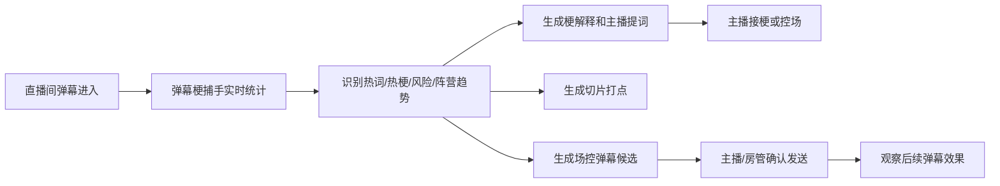

# 弹幕梗捕手产品介绍文档

版本：v1.0  
日期：2026-07-07  
产品名：弹幕梗捕手  
一句话定位：懂弹幕、会接梗、能控场的 AI 直播间节奏副驾。

## 1. 产品概述

弹幕梗捕手是一款面向虎牙直播主播端的 AI 场控助手。它以桌面悬浮窗的形式运行在主播电脑上，实时读取直播间弹幕，自动识别正在爆发的热梗、重复刷屏、观众情绪和潜在风险，并为主播生成可以直接说出口的接梗话术、互动话术和降温话术。

未来版本中，弹幕梗捕手还将进一步扩展自动场控能力。当系统识别到直播间出现人身攻击、负面带节奏、电竞阵营弹幕一边倒、冷场或高光爆点时，可以自动生成合适的场控弹幕，并在主播或房管确认后发送。例如，当弹幕攻击主播外貌时，系统可生成“哥哥长得明明很好看，别乱带节奏”；当 T1 vs BLG 的比赛直播中弹幕全是 BLG 加油时，系统可生成“T1加油，这边也得有点声音”。

## 2. 解决的问题

主播在直播时经常同时面对游戏画面、弹幕、礼物、房管提醒、直播数据和观众情绪。弹幕越热闹，主播越容易遇到三个问题：

1. 看不过来：高频弹幕和真正爆发的梗很容易被刷过去。
2. 接不上来：很多梗有来源、有语境，主播不知道怎么接才自然。
3. 控不住场：攻击性弹幕、引战、阵营争吵出现时，主播很难第一时间降温。

弹幕梗捕手要做的就是帮主播“多一双眼睛”和“多一个场控大脑”：它能从实时弹幕里找出重点，解释原因，并给出下一步动作。

## 3. 目标用户

| 用户 | 使用价值 |
| --- | --- |
| 游戏主播 | 快速发现热梗，降低看弹幕和接梗压力 |
| 电竞解说/赛事主播 | 识别阵营趋势，平衡双方弹幕声量 |
| 房管 | 提前发现攻击、刷屏、引战等风险 |
| 运营/剪辑 | 自动记录切片时间点，沉淀高光标题和封面文案 |
| 平台 | 提升直播间互动质量和内容二次分发效率 |

## 4. 核心功能

### 4.1 实时弹幕统计

产品会实时拉取直播间弹幕，并把相同或相似弹幕聚合展示。每条统计弹幕都会显示：

- 弹幕内容。
- 当前时间窗口内出现次数。
- 首次出现时间。
- 最近出现时间。
- 热度标签。

这让主播不用盯着滚动弹幕，也能知道现在直播间到底在刷什么。

### 4.2 置顶热词

当某条弹幕在短时间内频繁出现，系统会把它放到“置顶热词”区域。主播可以一眼看到当前直播间正在发酵的内容，例如：

- “下饭”
- “666”
- “T1加油”
- “BLG冲”
- “别带节奏”

### 4.3 AI 梗解释

主播点击某条弹幕后，右侧会打开“场控助手”详情窗口。系统会联网搜索并解释：

- 这句话是不是热梗。
- 梗的来源是什么。
- 为什么会在当前直播间爆发。
- 当前适不适合接。

### 4.4 主播提词器

系统会为主播生成三类可以直接念的话术：

| 类型 | 作用 |
| --- | --- |
| 接梗 | 帮主播幽默回应弹幕 |
| 爆了 | 拉动直播间气氛，让观众继续互动 |
| 降温 | 当弹幕负面或争吵时，帮助主播控场 |

示例：

```text
接梗：这波我承认，键盘刚才有自己的想法。
爆了：弹幕别装死，这波都能刷出来？今晚节目效果有了。
降温：玩梗可以，别往人身上带，点到为止。
```

### 4.5 热梗库与屏蔽库

主播可以把重要弹幕标记进热梗库，后续复盘或再次出现时快速调用。也可以把不想继续统计的弹幕加入屏蔽库，减少干扰。

### 4.6 一键切片打点

每条统计弹幕都会保留首次爆发时间。主播在详情窗口点击“打点”后，系统会记录该弹幕对应的时间点，方便下播后剪辑短视频。

适用场景：

- 某个梗第一次刷起来。
- 主播打出高光操作。
- 弹幕突然爆炸。
- 出现适合做标题的名场面。

### 4.7 桌面悬浮窗与桌宠入口

产品以桌面端形式运行：

- 支持窗口置顶。
- 支持透明度调节。
- 支持托盘菜单。
- 支持桌宠快捷打开。
- 不遮挡直播主画面。

## 5. 待开发亮点：自动弹幕场控

自动弹幕场控是下一阶段的重点能力。它会根据直播间状态自动生成场控弹幕，帮助主播和房管维护氛围。

### 5.1 人身攻击场控

当系统识别到弹幕中出现攻击主播、选手或嘉宾的言论时，会生成正向、降温的回应。

示例：

```text
哥哥长得明明很好看，别乱带节奏。
支持可以大声点，攻击选手就没必要了。
玩梗可以，别上升到人身攻击。
```

### 5.2 电竞阵营平衡

在电竞直播中，如果系统识别到对阵双方弹幕明显一边倒，会生成给弱势声量方加油的弹幕。

示例：

```text
T1加油，这边也得有点声音！
BLG加油，主场弹幕不能没声量！
支持各自队伍可以，别把加油刷成吵架。
```

### 5.3 冷场唤醒

当直播间弹幕密度下降，系统会提醒主播抛出轻互动。

示例：

```text
还在的兄弟扣个 1，我看看现在有多少人在。
这波想看稳一点还是整活，弹幕给个方向。
```

### 5.4 高光放大

当直播间出现“666”“牛”“名场面”等弹幕爆发时，系统会提示主播放大高光，并建议切片。

示例：

```text
这波真帅，名场面可以打点了。
刚才这波值得切片，懂的已经开始回放了。
```

## 6. 产品工作流



## 7. Demo 演示场景

### 场景 1：热梗爆发

主播失误后弹幕刷“下饭”“别送了”。系统自动把“下饭”放到置顶热词，主播点击后看到梗解释和接梗话术：

```text
这波确实下饭，但兄弟们别急，下一波我给你们加个菜。
```

### 场景 2：攻击言论出现

弹幕出现对主播外貌的攻击。系统识别为人身攻击风险，生成降温弹幕：

```text
哥哥长得明明很好看，别乱带节奏。
```

### 场景 3：赛事弹幕一边倒

T1 vs BLG 比赛中，弹幕几乎全是“BLG加油”。系统识别阵营趋势失衡，生成平衡弹幕：

```text
T1加油，这边也得有点声音！
```

### 场景 4：高光出现

主播完成极限反杀，弹幕刷“666”“名场面”。系统提示切片打点，并生成标题方向：

```text
全弹幕都以为寄了，主播下一秒极限反杀。
```

## 8. 当前项目进度

| 模块 | 状态 |
| --- | --- |
| 弹幕抓取 | 已完成 |
| UI 设计 | 已完成 |
| 前端主界面 | 约 80% 完成，核心展示可用 |
| AI 接口 | 已完成基础接入 |
| 桌面端打包 | 已完成 Windows 和 macOS 配置 |
| 热梗库/屏蔽库 | 已实现基础能力 |
| 切片打点 | 已实现基础能力 |
| 自动场控弹幕 | 待开发 |
| RAG 热梗知识库 | 待开发 |
| 观众端 | 待开发 |

## 9. 产品优势

### 9.1 比普通弹幕面板更聪明

它不只是显示弹幕，而是会把弹幕聚合、识别、解释和转化为行动建议。

### 9.2 比人工房管更实时

系统可以持续观察直播间趋势，及时发现风险和冷场，不需要人工一直盯屏。

### 9.3 比通用 AI 更懂直播语境

它结合直播间标题、主播信息、实时弹幕、热梗搜索和后续 RAG 知识库生成话术，更适合直播现场。

### 9.4 能把互动转化为内容资产

热梗、名场面和高光弹幕可以直接变成切片时间点、标题、封面文案和复盘素材。

## 10. 后续规划

### 第一阶段：完善主播端

- 接入统一实时分析引擎。
- 优化主窗口和详情窗口交互。
- 增强风险识别和阵营识别。

### 第二阶段：自动场控弹幕

- 识别人身攻击。
- 识别电竞阵营失衡。
- 生成场控弹幕候选。
- 支持复制、人工确认发送和发送日志。

### 第三阶段：RAG 热梗知识库

- 建立热梗库、电竞库、风险词库、主播私域梗库。
- 提升 AI 回答准确率。
- 降低联网搜索延迟。

### 第四阶段：观众端拓展

- 开发观众互动页面。
- 支持投票、话题、阵营互动。
- 让观众端和主播端形成互动闭环。

### 第五阶段：复盘与运营

- 自动生成下播复盘。
- 统计热梗生命周期。
- 输出切片标题、简介和封面文案。
- 评估每次接梗和控场效果。

## 11. 推荐汇报话术

可以这样介绍产品：

> 我们做的不是一个普通弹幕列表，而是一个直播间 AI 场控副驾。它能实时读懂弹幕，发现正在爆发的梗，告诉主播这个梗什么意思、为什么刷起来、该怎么接；当直播间出现攻击言论或阵营弹幕一边倒时，它还能生成场控弹幕，帮助主播把节奏拉回正向互动。

也可以更简短：

> 弹幕梗捕手让主播不用一直盯弹幕，也能知道直播间正在发生什么、该说什么、什么时候该控场、哪些瞬间值得切片。
