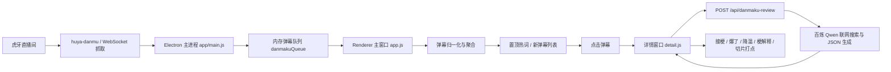
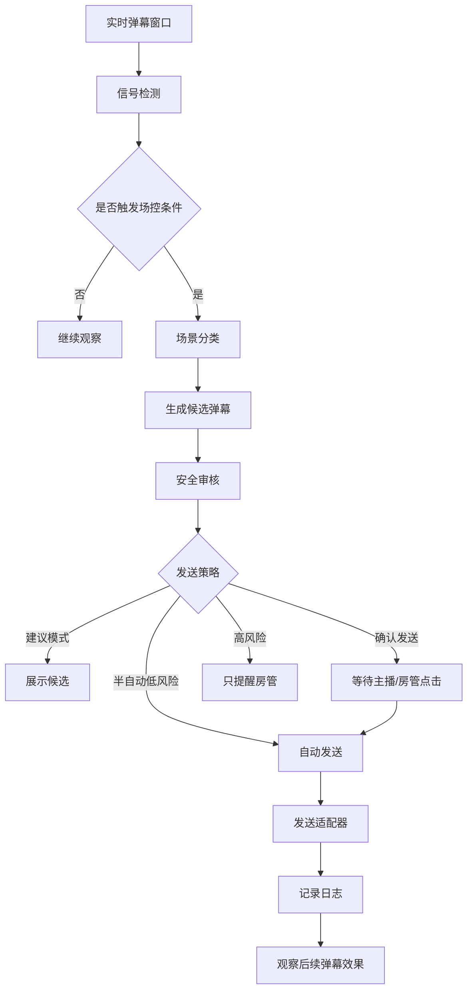
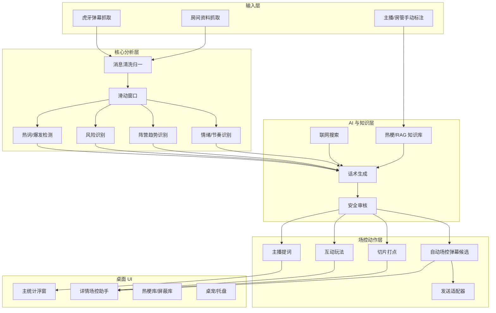

# 弹幕梗捕手与 AI 场控助手技术文档

版本：v1.0  
日期：2026-07-07  
项目目录：`E:\MXJ\wohu5`  
产品名：弹幕梗捕手  
目标形态：虎牙主播 PC 侧悬浮窗 / 桌面端 AI 场控助手

## 1. 文档目的

本文档用于完整说明当前项目的技术现状、系统架构、已实现能力、待开发能力，以及下一阶段“弹幕场控自动生成并发送弹幕”的设计方案。

本次整理不只参考 `huya-danmaku-copilot-tech-doc.md`，还综合了当前项目源码、桌面端实现、AI 接口实现、打包配置、历史对话中的产品设计记录和阶段性进度口径。当前项目已经从最初的“弹幕抓取 + PRD”演进为一个具备 Electron 桌面悬浮窗、真实虎牙弹幕接入、热词聚合、热梗库、选中弹幕 AI 联网识别、主播提词器、切片打点、桌宠入口、托盘菜单和跨平台打包配置的 Demo。

## 2. 当前项目结论

### 2.1 已实现能力

当前项目已经完成以下核心能力：

| 模块 | 当前状态 | 对应文件 |
| --- | --- | --- |
| 虎牙弹幕抓取 | 已实现，可连接真实直播间并缓存弹幕 | `server.js`、`app/main.js`、`local_huya_danmu/index.js` |
| 桌面端主程序 | 已实现 Electron 桌面应用、托盘、置顶、透明窗口 | `app/main.js` |
| 主窗口弹幕统计 | 已实现弹幕聚合、热词置顶、新弹幕列表、次数和时间记录 | `app/renderer/app.js`、`app/renderer/index.html` |
| 详情场控助手 | 已实现选中弹幕后的梗解释、主播提词、降温话术、切片打点 | `app/renderer/detail.js`、`app/renderer/detail.html` |
| AI 联网识别 | 已实现百炼兼容 OpenAI 风格接口调用，强制联网搜索并输出 JSON | `app/main.js` |
| 本地分析引擎 | 已实现滑动窗口、热度分数、风险分数、梗聚类的独立模块 | `analysis.js` |
| LLM 兜底服务 | 已实现 Gemini 调用与本地模板兜底 | `llm.js` |
| 热梗库/屏蔽库 | 已实现本地 `localStorage` 标记和屏蔽 | `app/renderer/app.js` |
| 桌宠入口 | 已实现可拖拽桌宠、点击打开/隐藏主窗口 | `app/renderer/pet.js` |
| 图标与品牌资产 | 已实现 AI 生成图标源图、应用图标、托盘图标生成 | `scripts/generate-icons.py`、`app/renderer/assets/*` |
| 打包配置 | 已实现 Windows portable 和 macOS dmg/zip 配置 | `package.json`、`.github/workflows/build-desktop.yml` |
| 配置校验 | 已实现桌面端配置校验脚本 | `scripts/verify-desktop-config.js` |

### 2.2 已有雏形但尚未统一进主链路的能力

`analysis.js` 和 `llm.js` 提供了完整的实时分析与生成思路，但当前桌面端主链路主要使用 `app/renderer/app.js` 的本地聚合逻辑和 `app/main.js` 的联网 AI 审核接口。后续需要把这些能力收敛成统一服务层，避免“同类能力分散在多个文件里”。

### 2.3 待开发核心能力

下一阶段最关键的待开发能力是“弹幕场控自动化”：

1. 自动识别人身攻击、辱骂、引战、刷屏、带节奏等风险。
2. 自动识别电竞直播中的阵营失衡或一边倒弹幕趋势。
3. 自动生成对应的场控弹幕。
4. 在合适的安全策略下发送弹幕，或先让主播/房管确认后发送。

示例：

| 场景 | 识别信号 | 生成弹幕示例 |
| --- | --- | --- |
| 弹幕攻击主播外貌 | “丑”“难看”“恶心”等攻击词上升 | “哥哥长得明明很好看，别乱带节奏。” |
| T1 vs BLG 时弹幕全是 BLG 加油 | 阵营词 BLG 占比明显高于 T1 | “T1加油，这边也得有点声音！” |
| 弹幕开始骂选手 | 选手名 + 辱骂词共现 | “支持可以大声点，攻击选手就没必要了。” |
| 直播间冷场 | 30 秒弹幕密度过低 | “还在的兄弟扣个 1，看看现在有多少人在。” |

## 3. 项目目标

### 3.1 产品目标

弹幕梗捕手不是单纯的弹幕列表工具，而是一个直播间节奏副驾。它要帮助主播在直播中快速完成四件事：

1. 看见：从海量弹幕里看见正在爆发的梗、趋势和风险。
2. 理解：解释弹幕背后的热梗、事件、阵营和语境。
3. 回应：生成主播能直接说出口的话术。
4. 控场：在负面节奏、阵营失衡、冷场时提供动作建议，未来进一步自动发送场控弹幕。

### 3.2 技术目标

技术侧要实现一条低延迟、可解释、可审计的实时链路：

```text
弹幕采集 -> 清洗归一 -> 时间窗口聚合 -> 热词/情绪/风险/阵营识别 -> AI 解释与生成 -> UI 展示 -> 人工确认或自动发送 -> 效果反馈
```

### 3.3 Hackathon MVP 目标

当前 MVP 应优先保证：

1. 能连接真实虎牙房间。
2. 能显示 30-60 秒内高频弹幕和新弹幕。
3. 能点击弹幕打开场控详情。
4. 能联网解释梗并生成接梗、爆了、降温话术。
5. 能记录切片打点。
6. 能演示自动场控弹幕的决策链路，即使发送阶段先采用“生成 + 人工复制/确认”。

## 4. 当前系统架构

### 4.1 当前主链路



### 4.2 当前进程职责

#### Electron 主进程

文件：`app/main.js`

职责：

- 创建桌面窗口：主统计窗口、详情窗口、桌宠窗口。
- 创建托盘菜单。
- 控制窗口置顶、透明度、位置、显示隐藏。
- 启动本地 Express API 服务。
- 连接虎牙直播间并缓存弹幕。
- 获取直播间资料。
- 调用 AI 联网识别接口。
- 通过 IPC 与 Renderer 通信。

#### Renderer 主窗口

文件：`app/renderer/app.js`

职责：

- 每秒拉取弹幕。
- 将弹幕按内容归一化聚合。
- 统计每条弹幕出现次数、首次出现时间、最近出现时间、参与用户数。
- 识别当前窗口内高频热词。
- 提供热梗标记、屏蔽、热梗库。
- 点击弹幕后打开详情窗口。

#### Renderer 详情窗口

文件：`app/renderer/detail.js`

职责：

- 接收主窗口传入的弹幕组上下文。
- 调用 AI 审核接口。
- 展示梗解释、爆发原因、接梗话术、互动话术、降温话术和联网搜索依据。
- 提供复制话术、复制上下文、一键切片打点。

#### 桌宠窗口

文件：`app/renderer/pet.js`

职责：

- 作为低干扰入口停留在桌面。
- 可拖拽。
- 点击切换主统计窗口。
- 右键菜单打开或关闭。

### 4.3 当前服务接口

当前 Electron 内置 Express 服务监听 3000 端口，提供：

| 方法 | 路径 | 状态 | 说明 |
| --- | --- | --- | --- |
| GET | `/api/danmaku` | 已实现 | 返回当前缓存弹幕队列 |
| POST | `/api/connect-room` | 已实现 | 连接直播间 |
| GET | `/api/status` | 已实现 | 返回连接状态、房间号、弹幕数量、房间资料 |
| GET | `/api/room-profile` | 已实现 | 获取虎牙房间资料 |
| POST | `/api/danmaku-review` | 已实现 | 对选中弹幕进行联网识别和话术生成 |

独立后端 `server.js` 也提供 `/api/danmaku`，用于早期命令行启动形态：

```powershell
node server.js 直播间号
```

## 5. 当前核心数据结构

### 5.1 原始弹幕

当前弹幕对象主要字段：

```json
{
  "nickname": "虎牙用户",
  "content": "T1加油",
  "timestamp": 1783339005000,
  "sourceTimestamp": 1783339005000
}
```

字段说明：

| 字段 | 类型 | 说明 |
| --- | --- | --- |
| `nickname` | string | 发言用户昵称 |
| `content` | string | 弹幕文本 |
| `timestamp` | number | 系统接收时间 |
| `sourceTimestamp` | number | 平台消息时间，若不可用则回退到接收时间 |

### 5.2 主窗口聚合弹幕组

`app/renderer/app.js` 会把相同或归一化后相同的弹幕聚合成组：

```json
{
  "key": "t1加油",
  "content": "T1加油",
  "count": 8,
  "firstAt": 1783339005000,
  "latestAt": 1783339035000,
  "uniqueUsers": 5,
  "samples": [],
  "score": 93,
  "tag": "高频"
}
```

### 5.3 AI 审核请求

详情窗口调用 `/api/danmaku-review` 时会发送：

```json
{
  "selectedDanmaku": {
    "content": "T1加油",
    "count": 8,
    "firstTimestamp": 1783339005000,
    "latestTimestamp": 1783339035000,
    "uniqueUsers": 5
  },
  "window": {
    "sizeMs": 60000,
    "startedAt": 1783338975000,
    "endedAt": 1783339035000
  },
  "samples": [],
  "context": [],
  "roomProfile": {}
}
```

### 5.4 AI 审核返回

当前期望 AI 返回：

```json
{
  "explanation": "梗含义和来源。",
  "reason": "为什么当前直播间会刷这条弹幕。",
  "reply": "主播接梗话术。",
  "interaction": "拉动气氛的话术。",
  "cooldown": "降温控场话术。",
  "searchEvidence": [
    {
      "title": "来源标题",
      "summary": "搜索事实摘要",
      "relevance": "与弹幕的关系"
    }
  ]
}
```

## 6. 实时分析算法现状

项目存在两套分析思路。

### 6.1 Renderer 聚合算法

文件：`app/renderer/app.js`

当前主窗口采用轻量本地聚合：

1. 每秒读取弹幕队列。
2. 归一化文本：去空格、去末尾标点、转小写。
3. 按归一化 key 聚合。
4. 统计次数、首次时间、最近时间、参与昵称集合。
5. 用 `heatScore` 计算热度。
6. 将 30 秒内活跃且次数或用户数达标的弹幕放入置顶热词。

当前热度评分：

```text
score = frequency + spread + recency + marked
frequency = min(60, count * 12)
spread = min(20, uniqueUsers * 5)
recency = max(0, 1 - ageMs / 30000) * 18
marked = marked ? 16 : 0
```

优点：

- 快速、稳定、无需后端复杂计算。
- 对 Demo 足够直观。
- 能精准保留首次出现和最近出现时间，便于切片打点。

不足：

- 对语义相近弹幕的聚类能力较弱。
- 对风险、阵营、情绪没有系统级判断。
- 不会自动触发场控动作，只在用户点击后进入详情。

### 6.2 AnalysisEngine 分析算法

文件：`analysis.js`

该模块更接近目标分析引擎，包含：

- 30 秒当前窗口。
- 30-60 秒历史窗口。
- 词频提取。
- 爆发增长计算。
- 梗聚类。
- 生命周期阶段。
- 情绪和风险计算。
- 热度分数。
- 风险分数。

当前内置梗词典：

| 聚类 | 示例词 |
| --- | --- |
| 失误调侃梗 | 下饭、菜、别送了、又寄了、送人头 |
| 高光赞赏梗 | 666、秀、牛逼、名场面、帅 |
| 节奏风险梗 | 退钱、演员、封号、举报、垃圾、傻逼、废物 |

当前热度公式：

```text
heat = frequencyScore * 0.35
     + growthScore * 0.30
     + userSpreadScore * 0.20
     + emotionScore * 0.10
     + giftBoostScore * 0.05
```

当前风险公式：

```text
risk = toxicKeywordScore * 0.40
     + repetitionScore * 0.25
     + negativeEmotionScore * 0.25
     + conflictScore * 0.10
```

建议：

- 下一阶段把 `AnalysisEngine` 接入 Electron 主进程或独立服务，作为统一实时分析引擎。
- Renderer 只负责展示，不再重复实现核心分析规则。

## 7. AI 生成能力现状

### 7.1 百炼联网 AI 审核

文件：`app/main.js`

当前主链路使用百炼兼容接口：

- Base URL：`https://ws-d2jrp9pxv8v3tdkq.cn-beijing.maas.aliyuncs.com/compatible-mode/v1`
- 模型：`qwen3.7-plus`
- Chat Completions：启用 `enable_search`
- Responses：使用 `tools: [{ type: "web_search" }]`
- 输出格式：JSON
- 缓存：10 分钟，按房间、主播、标题、分区、弹幕内容生成 cache key。

Prompt 的重点规则：

1. 必须联网搜索。
2. 搜索事实优先于直播间标题。
3. 先搜索弹幕原句。
4. 直播间信息只用于接法，不覆盖主流梗来源。
5. 输出固定 JSON 字段。
6. 话术要短、直接、像主播临场能说的话。
7. `interaction` 可以更炸场，但不能辱骂、歧视、色情或攻击真实个人。

### 7.2 Gemini + 本地模板服务

文件：`llm.js`

该模块提供：

- 冷清、失误、高光、带节奏、默认五类本地模板。
- Gemini 2.5 Flash JSON 输出。
- 互动玩法生成。
- 切片素材生成。

当前该模块没有完全接入 Electron 主链路，建议后续改造成统一 `ai-service`：

```text
AIService
  - reviewDanmaku()
  - generateHostLines()
  - generateAutoDanmaku()
  - generateInteraction()
  - generateClipCopy()
  - fallbackByTemplate()
```

## 8. 自动弹幕场控功能设计

### 8.1 功能定位

自动弹幕场控不是简单“机器人刷屏”，而是一个可控的直播间氛围修正器。它在识别到负面节奏、阵营失衡、冷场或高光爆点时，生成一句合适的场控弹幕，并根据策略决定：

1. 只展示建议。
2. 让主播/房管一键发送。
3. 在低风险场景自动发送。
4. 在高风险场景只提醒房管，不自动发送。

### 8.2 推荐 MVP 形态

MVP 阶段不建议直接全自动发送，建议做成“三段式”：

```text
识别信号 -> 生成候选弹幕 -> 主播/房管点击发送
```

这样既能演示智能场控，也能避免平台合规和账号风险。

### 8.3 增强版形态

增强版支持策略开关：

| 模式 | 说明 | 适用场景 |
| --- | --- | --- |
| 建议模式 | 只生成建议，不发送 | 默认安全模式 |
| 确认发送 | 主播/房管点击后发送 | 大多数正式直播场景 |
| 半自动 | 低风险互动自动发，高风险只提醒 | 成熟后可用 |
| 全自动 | 系统按策略自动发送 | 仅限内部 Demo 或授权账号 |

### 8.4 自动场控决策链路



### 8.5 场景分类

#### 8.5.1 人身攻击防御

触发信号：

- 人身攻击词出现。
- 攻击对象可能是主播、选手、嘉宾或观众。
- 负面词在 10-30 秒窗口内快速上升。
- 同一攻击内容被不同用户复读。

示例：

| 输入趋势 | 识别结果 | 候选弹幕 |
| --- | --- | --- |
| “主播好丑”“这脸别播了” | 主播外貌攻击 | “哥哥长得明明很好看，别乱带节奏。” |
| “某某废物”“别打职业了” | 选手攻击 | “支持战队可以，攻击选手就没必要了。” |
| “房管滚” | 房管攻击 | “大家理性一点，房管也是在维护直播间秩序。” |

注意：

- 生成弹幕不能对骂。
- 不要扩大攻击词。
- 不要点名具体攻击用户。
- 优先用轻松、正向、降温的语气。

#### 8.5.2 电竞阵营失衡

触发信号：

- 直播间标题或房间资料识别到对阵双方，如 `T1 vs BLG`。
- 弹幕窗口内阵营词明显一边倒。
- 某一方加油弹幕占比超过阈值，例如 75%。
- 另一方相关弹幕较少但比赛语境允许平衡氛围。

示例：

| 对局 | 当前趋势 | 候选弹幕 |
| --- | --- | --- |
| T1 vs BLG | 全是 BLG 加油 | “T1加油，这边也得有点声音！” |
| T1 vs BLG | 全是 T1 加油 | “BLG加油，主场弹幕也不能没声量！” |
| TES vs JDG | 两边互喷 | “支持各自队伍可以，别把加油刷成吵架。” |

阵营识别需要维护词典：

```json
{
  "teams": [
    {
      "id": "t1",
      "aliases": ["T1", "SKT", "飞科", "Faker"]
    },
    {
      "id": "blg",
      "aliases": ["BLG", "碧螺春", "全华班"]
    }
  ],
  "supportPatterns": ["加油", "冲", "赢", "拿下", "稳住"],
  "attackPatterns": ["滚", "菜", "废物", "别打了"]
}
```

#### 8.5.3 冷场唤醒

触发信号：

- 30 秒弹幕数量低于阈值。
- 新发言用户数低。
- 没有明显热词。

候选弹幕：

- “还在的兄弟扣个 1，我看看现在有多少人在。”
- “这波想看稳一点还是整活，弹幕给个方向。”

#### 8.5.4 高光放大

触发信号：

- “666”“牛”“帅”“名场面”等高光词快速增长。
- 弹幕密度明显上升。
- 风险分数低。

候选弹幕：

- “这波真帅，名场面可以打点了。”
- “刚才这波值得切片，懂的已经开始回放了。”

#### 8.5.5 梗解释补充

触发信号：

- 某个梗反复出现，但主播可能不知道来源。
- AI 联网识别拿到可靠依据。

候选弹幕：

- “这梗是最近刷起来的那个名场面，懂的都懂。”
- “这句不是乱刷，是有出处的，主播可以接一下。”

### 8.6 触发阈值建议

```json
{
  "toxicity": {
    "windowMs": 30000,
    "minNegativeCount": 3,
    "minUniqueUsers": 2,
    "riskScoreToSuggest": 35,
    "riskScoreToBlockAutoSend": 65
  },
  "teamImbalance": {
    "windowMs": 45000,
    "minSupportMessages": 8,
    "dominantRatio": 0.75,
    "minMinoritySilenceSeconds": 20
  },
  "coldStart": {
    "windowMs": 30000,
    "maxMessages": 3,
    "cooldownMs": 90000
  },
  "highlight": {
    "windowMs": 15000,
    "minPositiveCount": 6,
    "maxRiskScore": 30
  }
}
```

### 8.7 自动发送限流

无论是否自动发送，都必须做限流。

建议策略：

| 维度 | 限制 |
| --- | --- |
| 全局发送间隔 | 不低于 20 秒 |
| 同类场景间隔 | 不低于 60 秒 |
| 同文案发送间隔 | 不低于 10 分钟 |
| 单场直播总量 | 可配置，例如 100 条以内 |
| 高风险场景 | 默认禁止自动发送，只建议 |
| 连续失败 | 进入暂停状态 |

### 8.8 安全审核规则

自动发送前必须进行二次审核：

1. 不包含辱骂、歧视、色情、人身攻击。
2. 不攻击真实个人。
3. 不诱导网暴。
4. 不泄露隐私。
5. 不冒充平台官方。
6. 不承诺抽奖、福利、金钱收益，除非真实活动已配置。
7. 不包含敏感政治、违法违规、平台禁词。
8. 不发送过长文本。
9. 不重复刷屏。

示例安全过滤：

```js
function validateAutoDanmaku(text, context) {
  if (!text || text.length > 40) return false;
  if (TOXIC_KEYWORDS.some((word) => text.includes(word))) return false;
  if (context.riskScore >= 65 && context.mode !== 'manual_confirm') return false;
  return true;
}
```

### 8.9 发送适配器设计

当前项目只实现了抓取弹幕，没有实现向虎牙直播间发送弹幕。发送能力需要单独设计。

推荐抽象：

```ts
interface DanmakuSendAdapter {
  name: string;
  isAvailable(): Promise<boolean>;
  send(payload: SendDanmakuPayload): Promise<SendDanmakuResult>;
}

interface SendDanmakuPayload {
  roomId: string;
  content: string;
  scene: string;
  generatedBy: 'ai' | 'template';
  mode: 'manual' | 'semi_auto' | 'auto';
  traceId: string;
}
```

适配器方案：

| 方案 | 说明 | 推荐程度 |
| --- | --- | --- |
| 官方/授权 API | 最稳妥，需要平台授权 | 生产推荐 |
| 主播 PC 客户端插件 API | 如果虎牙开放插件通信能力，可通过客户端能力发送 | 推荐 |
| 浏览器自动化/页面注入 | 仅适合内部 Demo，风险较高 | Demo 可选 |
| 复制到剪贴板 | 最安全，主播手动粘贴发送 | MVP 推荐 |

MVP 建议先做：

1. 生成候选弹幕。
2. 提供“一键复制”。
3. 提供“已发送”按钮记录效果。
4. 后续再接真实发送适配器。

### 8.10 自动场控日志

每次生成或发送都要记录日志：

```json
{
  "traceId": "ctrl_001",
  "roomId": "30764305",
  "scene": "team_imbalance",
  "trigger": {
    "windowMs": 45000,
    "dominantTeam": "BLG",
    "minorityTeam": "T1",
    "dominantRatio": 0.86
  },
  "candidate": "T1加油，这边也得有点声音！",
  "decision": "manual_confirm",
  "sent": false,
  "createdAt": 1783339035000
}
```

日志用于：

- 复盘 AI 控场效果。
- 评估误触发。
- 训练模板和 RAG。
- 回滚问题策略。

## 9. 目标系统架构

建议下一阶段把系统拆成以下模块：



## 10. RAG 与热梗信息库设计

历史进度中已明确后续要做“优化 AI 接口性能，接入 RAG，热梗信息收集”。建议设计如下。

### 10.1 RAG 目标

RAG 用于解决：

- 大模型不知道最新热梗。
- 联网搜索慢。
- 同一梗多次重复解释浪费时间。
- 直播间专属梗需要沉淀。
- 电竞队伍、选手、赛事、角色别名需要结构化。

### 10.2 知识库类型

| 知识库 | 内容 | 更新方式 |
| --- | --- | --- |
| 热梗库 | 网络热梗、直播梗、平台常用语 | 内容组收集 + AI 摘要 |
| 电竞知识库 | 战队、选手、赛事、对阵、别名 | 人工维护 + 赛事数据导入 |
| 主播私域梗库 | 主播直播间历史梗、粉丝称呼、口头禅 | 自动沉淀 + 主播标记 |
| 风险词库 | 辱骂、引战、人身攻击、平台敏感词 | 人工维护 |
| 话术模板库 | 接梗、降温、拉互动、阵营平衡模板 | 内容组维护 |

### 10.3 检索流程

```text
弹幕文本 + 房间信息 + 当前趋势
  -> query rewrite
  -> 检索热梗库/电竞库/私域梗库/风险词库
  -> 取 TopK 片段
  -> 与实时窗口统计一起进入生成 Prompt
  -> 输出结构化话术与依据
```

### 10.4 数据示例

```json
{
  "id": "meme_001",
  "type": "esports_team",
  "name": "T1",
  "aliases": ["T1", "SKT", "Faker", "飞科"],
  "description": "韩国英雄联盟职业战队。",
  "safeUsage": [
    "T1加油",
    "T1这边也来点声音"
  ],
  "riskNotes": [
    "避免攻击对手战队或真实选手"
  ],
  "updatedAt": 1783339035000
}
```

## 11. API 设计建议

### 11.1 实时分析接口

```http
GET /api/analysis/current
```

响应：

```json
{
  "roomMood": "调侃",
  "tempo": "梗在发酵",
  "heatScore": 82,
  "riskScore": 18,
  "topMemes": [],
  "teamTrend": {
    "match": "T1 vs BLG",
    "teams": [
      { "id": "t1", "supportCount": 2, "ratio": 0.14 },
      { "id": "blg", "supportCount": 12, "ratio": 0.86 }
    ],
    "imbalance": true
  }
}
```

### 11.2 自动场控候选接口

```http
POST /api/control/candidates
```

请求：

```json
{
  "mode": "suggest",
  "analysis": {},
  "roomProfile": {},
  "recentMessages": []
}
```

响应：

```json
{
  "scene": "team_imbalance",
  "severity": "medium",
  "candidates": [
    {
      "text": "T1加油，这边也得有点声音！",
      "reason": "当前 45 秒内 BLG 加油弹幕占比 86%，T1 声量明显偏低。",
      "risk": "low",
      "sendMode": "manual_confirm"
    }
  ]
}
```

### 11.3 发送接口

```http
POST /api/control/send
```

请求：

```json
{
  "roomId": "30764305",
  "content": "T1加油，这边也得有点声音！",
  "scene": "team_imbalance",
  "mode": "manual",
  "traceId": "ctrl_001"
}
```

响应：

```json
{
  "ok": true,
  "sendId": "send_001",
  "sentAt": 1783339035000
}
```

## 12. 前端改造建议

### 12.1 主窗口新增控场提示区

主窗口底部或置顶热词下方增加“场控提醒”：

```text
场控提醒
风险：低
趋势：BLG 加油声量偏高
建议弹幕：T1加油，这边也得有点声音！
[复制] [发送] [忽略]
```

### 12.2 详情窗口新增自动场控模块

详情窗口当前有：

- 主播提词器
- 切片打点
- 梗解释

建议新增：

- 场控弹幕候选
- 触发原因
- 安全等级
- 发送模式
- 发送/复制/忽略按钮
- 发送后效果观察

### 12.3 热梗库扩展

当前热梗库只保存标记和屏蔽。建议扩展为：

| 类型 | 用途 |
| --- | --- |
| 标记热梗 | 后续复用解释 |
| 屏蔽弹幕 | 不再进入统计 |
| 阵营词 | 判断赛事支持趋势 |
| 风险词 | 判断负面控场 |
| 主播口吻 | 生成更像主播的话术 |

## 13. 安全与合规注意事项

### 13.1 API Key

当前 `app/main.js` 中存在默认 API Key 字符串。发布或提交公开仓库前必须处理：

1. 移除硬编码 Key。
2. 改为 `.env`、系统环境变量或本机配置文件。
3. 打包时通过安全配置注入。
4. 对 Key 做权限和额度限制。

### 13.2 自动发送风险

自动发送弹幕涉及账号行为，应遵循：

- 默认人工确认。
- 保存发送日志。
- 支持一键停用自动发送。
- 高风险场景不自动发送。
- 避免刷屏。
- 避免冒充用户或平台。

### 13.3 内容安全

场控弹幕必须是降温、平衡、正向引导，而不是对立、挑衅或煽动。

错误示例：

```text
BLG粉别叫了
骂主播的都滚
对面都是菜
```

正确示例：

```text
支持各自队伍可以，别把加油刷成吵架。
哥哥长得明明很好看，别乱带节奏。
T1加油，这边也得有点声音！
```

## 14. 测试策略

### 14.1 已有测试

当前 `npm test` 包含：

- Renderer 脚本语法检查。
- 桌面端配置校验。

命令：

```powershell
npm test
```

### 14.2 建议新增测试

| 测试类型 | 覆盖内容 |
| --- | --- |
| 单元测试 | `AnalysisEngine` 热度、风险、阵营识别 |
| Prompt 合约测试 | AI 返回 JSON 字段完整性 |
| 安全测试 | 自动弹幕过滤违规词 |
| 限流测试 | 自动发送间隔和同文案去重 |
| UI 测试 | 主窗口/详情窗口按钮状态 |
| 端到端 Demo | 模拟 T1 vs BLG、攻击主播、冷场、高光四个脚本 |

### 14.3 自动场控测试用例

```json
[
  {
    "name": "主播外貌攻击",
    "messages": ["主播好丑", "这脸别播了", "主播好丑"],
    "expectedScene": "personal_attack",
    "expectedMode": "manual_confirm",
    "expectedCandidateIncludes": "别乱带节奏"
  },
  {
    "name": "电竞阵营失衡",
    "roomTitle": "T1 vs BLG",
    "messages": ["BLG加油", "BLG冲", "BLG拿下", "BLG加油", "T1别输"],
    "expectedScene": "team_imbalance",
    "expectedCandidateIncludes": "T1加油"
  }
]
```

## 15. 开发路线图

### 15.1 第一阶段：现有能力整理

目标：

- 保持当前桌面端稳定。
- 把 `analysis.js` 接入主进程。
- 将分析结果推送给 Renderer。
- 统一 AI 服务入口。

交付：

- `/api/analysis/current`
- 主窗口展示风险/热度/趋势。
- 详情窗口继续可用。

### 15.2 第二阶段：自动场控候选

目标：

- 实现人身攻击检测。
- 实现电竞阵营趋势识别。
- 生成候选场控弹幕。
- 前端展示候选，支持复制和忽略。

交付：

- `/api/control/candidates`
- 场控提醒 UI
- 场控日志

### 15.3 第三阶段：人工确认发送

目标：

- 接入发送适配器抽象。
- MVP 先支持复制到剪贴板或手动确认。
- 如果有平台授权，再接真实发送。

交付：

- `/api/control/send`
- 发送模式配置
- 限流与安全审核

### 15.4 第四阶段：RAG 与热梗库

目标：

- 建立热梗库、电竞库、风险词库。
- 接入检索增强。
- 降低联网搜索延迟。

交付：

- 本地或云端知识库。
- 内容组维护入口。
- AI 生成质量评估。

### 15.5 第五阶段：观众端与复盘

目标：

- 另开发观众端互动能力。
- 沉淀直播切片、热梗复盘、场控效果评分。

交付：

- 观众互动页面。
- 下播复盘报告。
- 热梗与场控效果数据面板。

## 16. 小组分工建议

根据历史进度口径，小组为 2 人内容组、3 人技术组。

| 小组 | 人数 | 职责 |
| --- | ---: | --- |
| 内容组 | 2 | 收集热梗、电竞队伍别名、常见风险词、主播控场话术、互动玩法、产品介绍材料 |
| 技术组 | 3 | 弹幕抓取、桌面端 UI、AI 接口、分析引擎、自动场控、RAG 接入、打包测试 |

技术组可再拆：

| 方向 | 工作 |
| --- | --- |
| 前端桌面端 | 主窗口、详情窗口、场控提示、热梗库、桌宠 |
| 后端与弹幕 | 虎牙连接、API、滑动窗口、发送适配器 |
| AI 与算法 | 风险识别、阵营识别、Prompt、RAG、安全审核 |

## 17. 关键实现建议

### 17.1 先统一实时分析结果

当前主窗口只做聚合，详情窗口只在点击后 AI 分析。自动场控需要“未点击也能分析”。因此第一步应当让主进程持续运行分析引擎：

```text
huyaClient.on('message') -> analysisEngine.addMessage(item) -> currentAnalysis = analysisEngine.analyze()
```

### 17.2 自动场控不要直接依赖大模型

触发判断应以规则和统计为主，大模型只负责生成自然语言。

原因：

- 规则更可控。
- 延迟更低。
- 方便解释为什么触发。
- 避免模型误判导致乱发。

### 17.3 先模板后 AI

高频场景可以先用模板：

```json
{
  "personal_attack_anchor_appearance": [
    "哥哥长得明明很好看，别乱带节奏。",
    "玩梗可以，别上升到人身攻击。"
  ],
  "team_imbalance": [
    "{minorityTeam}加油，这边也得有点声音！",
    "{minorityTeam}粉丝呢，弹幕支棱一下。"
  ]
}
```

大模型用于：

- 根据主播口吻润色。
- 结合当前房间标题和上下文。
- 避免模板重复。

### 17.4 自动发送先做“可撤退”

必须有：

- 总开关。
- 场景开关。
- 发送冷却。
- 发送日志。
- 失败暂停。
- 人工确认模式。

## 18. 当前风险清单

| 风险 | 影响 | 建议 |
| --- | --- | --- |
| API Key 硬编码 | 泄露和滥用风险 | 改环境变量和本地配置 |
| 分析逻辑分散 | 后续维护困难 | 统一分析服务 |
| 自动发送未接平台授权 | 不能安全生产使用 | MVP 先复制/确认发送 |
| 联网搜索延迟 | 详情加载慢 | RAG + 缓存 + 模板兜底 |
| 风险词库粗糙 | 误判或漏判 | 内容组维护 + 规则迭代 |
| 发送弹幕可能引战 | 直播间负反馈 | 安全审核 + 高风险不自动发 |
| `node_modules` 和 release 体积大 | 项目扫描和协作成本高 | 文档/提交时排除产物 |

## 19. 总结

当前项目已经具备“真实弹幕接入 + 桌面悬浮窗 + 热词统计 + AI 梗解释 + 主播提词 + 切片打点”的完整 Demo 雏形。下一阶段的关键不是重新做一个 PRD，而是把已存在的能力收束成统一的实时分析和场控决策链路。

“自动弹幕场控”建议从安全 MVP 开始：先识别场景、生成候选、人工确认，再逐步过渡到低风险自动发送。对于人身攻击和电竞阵营一边倒这类场景，系统应当以降温、平衡、正向引导为核心，而不是制造新的对立。

推荐一句技术侧总结：

> 弹幕梗捕手的核心架构，是把实时弹幕流转化成可解释的直播间状态，再由 AI 生成可执行的主播话术、场控弹幕和内容资产。
