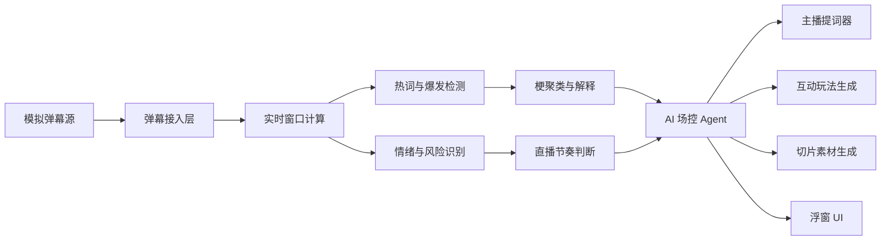

# 虎牙直播主播 PC 客户端插件技术方案

项目名称：虎牙弹幕梗捕手与场控助手  
产品形态：主播 PC 客户端侧边浮窗插件 Demo  
目标场景：直播中实时理解弹幕、捕捉热梗、辅助主播接梗控场，并沉淀互动与内容资产  
版本目标：2 天 1 夜 Hackathon MVP

## 1. 项目背景

主播在直播过程中需要同时关注游戏画面、弹幕、礼物、房管提醒、直播数据和观众情绪。尤其在弹幕密集或节奏变化较快的场景下，主播很容易错过正在爆发的梗、观众真正关注的点，或者在负面弹幕出现时没有及时控场。

本项目希望做一个嵌入虎牙直播主播 PC 客户端的 AI 浮窗插件。它不需要真实接入客户端，只需以独立浮窗 Demo 的形式模拟运行，展示 AI 如何成为主播的实时场控副驾。

## 2. 产品定位

一句话定位：

> 一个实时读懂弹幕、捕捉直播间热梗、辅助主播接梗控场，并自动生成互动玩法和切片素材的 AI 场控助手。

核心价值：

- 对主播：降低看弹幕和接梗压力，提升直播互动效果。
- 对房管：提前发现带节奏、刷屏、争吵等风险。
- 对运营：把直播中的热梗沉淀为切片标题、表情包文案、复盘摘要。
- 对平台：提升直播间互动质量和内容二次分发效率。

## 3. 使用形态

插件以“悬浮窗”形式运行在虎牙直播主播 PC 客户端上方，不需要真实侵入客户端。

浮窗建议位置：

- 默认吸附在直播预览画面右侧或弹幕区域左侧。
- 支持折叠为迷你模式，只显示当前热梗、风险等级和一句主播提示。
- 支持展开为完整面板，展示热梗雷达、主播提词、互动建议和切片素材。

Demo 实现方式：

- 使用 Web 页面模拟浮窗插件。
- 使用半透明深色面板贴近虎牙主播端视觉。
- 使用模拟弹幕流代替真实客户端数据。
- 使用本地脚本或 WebSocket 模拟实时弹幕输入。

## 4. MVP 功能范围

### 4.1 实时弹幕流

模拟直播间弹幕持续进入系统。

输入数据字段：

```json
{
  "id": "msg_001",
  "userId": "u_10086",
  "nickname": "虎牙用户",
  "content": "主播这波下饭了",
  "timestamp": 1720000000000,
  "gift": null,
  "level": 16
}
```

MVP 可使用预置弹幕脚本，按时间顺序推送，形成真实直播间滚动效果。

### 4.2 热梗捕捉

系统从最近 30 秒或 60 秒弹幕窗口中识别正在上升的梗。

识别维度：

- 高频词：短时间内重复出现的词。
- 爆发词：相比前一个时间窗口明显增长的词。
- 语义聚类：把“下饭”“菜”“别送了”“又寄了”聚合为同一类“失误调侃梗”。
- 变体识别：识别谐音、重复刷屏、表情变体。

输出示例：

```json
{
  "meme": "下饭",
  "cluster": "失误调侃梗",
  "heat": 87,
  "trend": "rising",
  "examples": ["主播这波下饭", "别送了", "这操作太菜了"],
  "risk": "low"
}
```

### 4.3 弹幕情绪与直播节奏判断

系统判断当前直播间氛围。

情绪标签：

- 欢乐
- 调侃
- 激动
- 焦躁
- 争吵
- 冷场
- 带节奏

节奏标签：

- 热场中
- 爆点出现
- 梗在发酵
- 冷场预警
- 负面升温
- 需要控场

输出示例：

> 当前观众正在围绕主播失误玩梗，情绪以调侃为主，负面风险较低。建议主播用自嘲方式接梗，并发起一次轻互动。

### 4.4 主播实时提词器

根据当前热梗和情绪，生成可直接说出口的话术。

话术类型：

- 接梗话术
- 拉互动话术
- 降温控场话术

示例：

```json
{
  "memeReply": "兄弟们这波我承认，是我键盘先动的手。",
  "interaction": "弹幕扣 1，相信我下一波能找回场子。",
  "cooldown": "大家先别急，这把还有机会，我认真操作一波。"
}
```

### 4.5 场控动作建议

系统根据直播间状态推荐可执行动作。

动作类型：

- 发起投票
- 生成抽奖话术
- 提醒房管关注风险词
- 推荐切片打点
- 推荐上屏关键词

示例：

> 建议发起投票：“主播下一波能不能稳住？”  
> 选项：能翻盘 / 继续下饭 / 先相信一手

### 4.6 内容资产沉淀

当某个梗达到热度阈值后，系统生成可复用素材。

生成内容：

- 短视频标题
- 切片简介
- 封面文案
- 表情包文案
- 下播复盘摘要

示例：

> 切片标题：《全直播间都在刷下饭，主播下一秒直接证明自己》  
> 封面文案：刚被弹幕嘲笑，反手打出名场面

## 5. 亮点功能设计

### 5.1 梗生命周期雷达

每个梗分为 5 个阶段：

1. 萌芽：少量观众开始提及。
2. 爆发：短时间内大量刷屏。
3. 扩散：出现变体、二创、接龙。
4. 衰退：提及量下降。
5. 沉淀：适合生成切片、标题或表情包。

前端展示：

- 梗名称
- 当前阶段
- 热度分数
- 上升速度
- 可操作建议

### 5.2 接梗效果评分

主播采纳系统建议后，系统观察后续 30 秒弹幕变化，给出接梗效果评分。

评分指标：

- 弹幕量变化
- 正向情绪变化
- 梗扩散程度
- 互动参与度
- 负面风险变化

输出示例：

> 本次接梗得分 86。弹幕量提升 42%，正向互动提升 31%，负面风险无明显上升。

### 5.3 房管风险雷达

识别带节奏和风险弹幕。

风险类型：

- 刷屏
- 辱骂
- 引战
- 恶意复读
- 人身攻击
- 敏感话题

MVP 不需要真实执行禁言，只提供建议：

> “菜就别播”类弹幕上升，建议房管限制重复内容。主播可使用自嘲话术降温。

## 6. 系统架构



### 6.1 前端层

职责：

- 展示插件浮窗。
- 展示实时弹幕。
- 展示热梗榜、情绪、风险、提词建议。
- 提供“采纳话术”“生成互动”“生成切片标题”等按钮。

建议技术：

- React / Vue / 原生 Web 均可。
- WebSocket 或 setInterval 模拟弹幕流。
- ECharts / Canvas 展示热度曲线和仪表盘。

### 6.2 后端层

职责：

- 接收弹幕流。
- 维护滑动时间窗口。
- 计算词频、爆发度、情绪、风险。
- 调用 LLM 生成话术和素材。
- 向前端推送分析结果。

建议技术：

- Node.js + Express + WebSocket。
- 或 Python FastAPI + WebSocket。

### 6.3 AI 能力层

MVP 中 AI 能力可以分成两类：

规则算法：

- 弹幕密度计算
- 高频词提取
- 爆发度计算
- 风险词初筛
- 梗热度打分

LLM 生成：

- 梗解释
- 直播节奏总结
- 主播话术生成
- 互动玩法生成
- 切片标题生成

## 7. 核心算法设计

### 7.1 弹幕滑动窗口

维护最近 10 秒、30 秒、60 秒三个窗口。

指标：

- messageCount：弹幕数量
- uniqueUserCount：发言人数
- tokenFrequency：分词词频
- negativeCount：负面弹幕数
- repeatedMessageCount：重复弹幕数

### 7.2 热度分数

热度分数示例：

```text
heat = frequencyScore * 0.35
     + growthScore * 0.30
     + userSpreadScore * 0.20
     + emotionScore * 0.10
     + giftBoostScore * 0.05
```

解释：

- frequencyScore：当前窗口出现频次。
- growthScore：相比上一个窗口的增长幅度。
- userSpreadScore：不同用户参与程度。
- emotionScore：情绪强度。
- giftBoostScore：是否伴随礼物或互动行为。

### 7.3 风险分数

```text
risk = toxicKeywordScore * 0.40
     + repetitionScore * 0.25
     + negativeEmotionScore * 0.25
     + conflictScore * 0.10
```

风险等级：

- 0-30：低风险
- 31-60：中风险
- 61-100：高风险

## 8. API 设计

### 8.1 推送弹幕

```http
POST /api/danmaku
```

请求：

```json
{
  "content": "主播这波下饭了",
  "nickname": "小虎牙",
  "timestamp": 1720000000000
}
```

### 8.2 获取当前分析结果

```http
GET /api/analysis/current
```

响应：

```json
{
  "roomMood": "调侃",
  "tempo": "梗在发酵",
  "heatScore": 82,
  "riskScore": 18,
  "topMemes": [
    {
      "name": "下饭",
      "cluster": "失误调侃梗",
      "stage": "爆发",
      "heat": 87
    }
  ],
  "suggestions": {
    "reply": "兄弟们这波我承认，是我键盘先动的手。",
    "interaction": "弹幕扣 1，相信我下一波能找回场子。",
    "moderation": "当前风险低，可以继续放大调侃氛围。"
  }
}
```

### 8.3 生成互动玩法

```http
POST /api/agent/interaction
```

请求：

```json
{
  "meme": "下饭",
  "mood": "调侃",
  "scene": "游戏失误后弹幕刷屏"
}
```

响应：

```json
{
  "type": "poll",
  "title": "主播下一波能不能稳住？",
  "options": ["能翻盘", "继续下饭", "先相信一手"],
  "hostLine": "来兄弟们投一票，看看你们还相不相信我。"
}
```

### 8.4 生成切片素材

```http
POST /api/agent/clip-copy
```

响应：

```json
{
  "title": "全直播间都在刷下饭，主播下一秒直接证明自己",
  "coverText": "刚被弹幕嘲笑，反手打出名场面",
  "description": "主播失误后弹幕疯狂玩梗，没想到下一波直接打出高光操作。"
}
```

## 9. 浮窗 UI 设计

### 9.1 面板结构

浮窗分为 5 个区域：

1. 顶部状态栏
   - 当前模式：场控助手运行中
   - 直播间热度
   - 风险等级

2. 热梗雷达
   - Top 3 热梗
   - 热度值
   - 生命周期阶段
   - 趋势箭头

3. 主播提词器
   - 当前最佳接梗话术
   - 拉互动话术
   - 降温话术

4. 场控动作
   - 一键生成投票
   - 推荐切片打点
   - 房管提醒

5. 内容资产
   - 切片标题
   - 封面文案
   - 表情包文案

### 9.2 迷你模式

折叠后只显示：

```text
热梗：下饭 ↑87
氛围：调侃
建议：自嘲接梗，发起投票
```

### 9.3 视觉风格

- 深色半透明背景，贴合主播 PC 客户端。
- 高亮色使用虎牙黄、能量橙、风险红、健康绿。
- 信息密度适中，避免遮挡直播预览。
- 所有建议必须短句化，方便主播扫一眼就能说。

## 10. Demo 演示脚本

### 场景 1：冷场

弹幕较少，系统提示：

> 当前弹幕密度偏低，建议抛出轻互动问题。

生成话术：

> 兄弟们今天想看稳一点还是整点节目效果？

### 场景 2：失误梗爆发

主播游戏失误，弹幕刷“下饭”“别送了”“开香槟”。

系统识别：

- 热梗：下饭
- 阶段：爆发
- 情绪：调侃
- 风险：低

提词：

> 这波确实下饭，但兄弟们别急，下一波我给你们加个菜。

互动：

> 发起投票：主播下一波能不能稳住？

### 场景 3：负面升温

弹幕出现攻击性内容。

系统提示：

> 负面弹幕上升，建议主播轻松带过，不要正面争辩。房管关注重复攻击内容。

降温话术：

> 大家别吵，游戏嘛，输赢都有。我们下一把认真打回来。

### 场景 4：高光出现

主播完成反杀，弹幕刷“666”“这都能赢”“名场面”。

系统输出：

- 自动打点：建议切片
- 标题：《全弹幕都以为寄了，主播下一秒极限反杀》
- 封面文案：这波真给他装到了

## 11. 2 天 1 夜开发计划

### 第 1 天上午

- 确定 Demo 交互流程。
- 准备 3-4 组弹幕脚本。
- 搭建前端浮窗 UI。
- 搭建后端 WebSocket 或定时推送服务。

### 第 1 天下午

- 实现弹幕滑动窗口。
- 实现高频词、爆发词、热度分数。
- 实现基础情绪和风险规则。
- 打通前后端实时展示。

### 第 1 天晚上

- 接入 LLM 生成提词、互动、切片标题。
- 完成热梗生命周期展示。
- 完成迷你模式和展开模式。

### 第 2 天上午

- 补齐接梗评分、风险雷达、内容资产区。
- 优化 UI 动效和演示数据。
- 准备讲解 PPT 和演示脚本。

### 第 2 天下午

- 联调完整 Demo。
- 准备兜底方案：若 AI 调用失败，使用预置生成结果。
- 彩排 3 分钟演示。

## 12. 技术风险与兜底

| 风险 | 影响 | 兜底方案 |
| --- | --- | --- |
| LLM 响应慢 | 现场演示卡顿 | 提前缓存几组 AI 输出 |
| 生成内容不稳定 | 话术质量波动 | 使用结构化 Prompt 和 JSON 输出 |
| 弹幕分词不准 | 热梗识别不稳定 | 使用预置词库 + 简单 n-gram |
| UI 信息太多 | 评委看不清 | 保留热梗、提词、动作三个核心区 |
| 实时链路出错 | Demo 中断 | 提供本地回放模式 |

## 13. 评审亮点总结

本项目不是普通的弹幕分析工具，而是一个面向虎牙直播场景的 AI 场控副驾。

核心亮点：

- 实时性：弹幕进入后立刻完成热梗、情绪、风险分析。
- 业务性：直接服务主播接梗、互动、控场和切片。
- 闭环性：发现梗、解释梗、建议接梗、评估效果、沉淀素材。
- 可落地性：不依赖真实客户端接入，浮窗插件 Demo 即可完整演示。
- 平台价值：提升直播间互动质量，并把即时热度转化为可分发内容资产。

推荐最终讲法：

> 我们做的不是一个“看弹幕的面板”，而是一个“直播间节奏引擎”。它能在主播最忙的时候帮他发现观众正在玩什么梗、该怎么接、什么时候该控场，以及哪些瞬间值得沉淀成内容。
